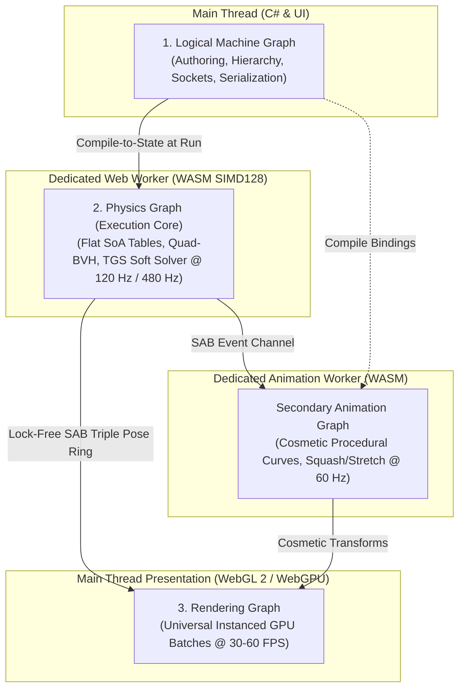

# Architecture Spine — Curious Contraptions Engine

## Design Paradigm

The engine decouples authoring, simulation, and presentation into three independent graphs with strictly one-way data flow:



### 1. Logical Scene / Machine Graph (Main Thread)
Hierarchical authoring representation manipulated by the player in build mode. C# objects manage entity trees, sockets, wiring, placement bounding boxes, and JSON serialization. When the player clicks **Run**, this graph compiles atomically into a flat, contiguous, SIMD-aligned state snapshot.

### 2. Physics Graph (Dedicated Simulation Worker)
A single homogeneous scene record executing in WebAssembly SIMD128 (`wasm-simd128`) on a dedicated Web Worker at 120 Hz (4 sub-steps of rational $h = 1/480\text{ s}$). Advanced by **one generic solver**. No puzzle element possesses its own solver, kernel branch, or per-tick loop. New elements are added purely via declaration data.

### 3. Secondary Animation Graph (Dedicated Animation Worker)
Cosmetic evaluators running at 60 Hz on an independent WebAssembly Web Worker, evaluating procedural curves, squashes, stretches, and light transitions. Fed one-way by physics events and committed state; never writes back into physical authority.

### 4. Rendering Graph (Browser Main Thread)
Samples read-only committed poses from a lock-free pre-allocated `SharedArrayBuffer` triple pose ring using shortest-arc quaternion Slerp interpolation. Issues instanced draw calls (`gl.drawElementsInstanced` in WebGL 2, `renderPass.drawIndexed` in WebGPU) grouped by `(MeshID, PipelineID)`. Eliminates GPU readback stalls (`mapAsync` is completely eradicated).

---

## Invariants & Rules

### AD-01 — Tri-Graph Decoupling & One-Way Data Flow
- **Binds:** `all`
- **Prevents:** Circular dependencies, GPU readback stalls, coupling between cosmetic animation and physical truth, frame rate dependencies in solver outcomes.
- **Rule:** Data flows strictly one-way: `Machine Graph -> Physics Graph -> Pose Ring -> Rendering Graph` and `Physics Graph -> Animation Graph -> Rendering Graph`. Neither animation nor rendering may mutate physical simulation state. Physics advances at fixed 120 Hz (480 Hz substeps); animation evaluates at 60 Hz; rendering follows display refresh (30–60 FPS).

### AD-02 — Strictly Zero External Physics Dependencies
- **Binds:** Physics solver, collision detection, and spatial partitioning.
- **Prevents:** Bloat, external license mismatches, non-deterministic WASM runtime divergence, hidden CPU fallback loops, black-box solver bugs.
- **Rule:** The engine relies on **zero external physics libraries** (no Box2D, no Jolt, no Rapier, no PhysX; zero npm/NuGet physics packages). All algorithms, vector mathematics, BVH hierarchies, and constraint solvers are 100% custom, in-engine C# and TypeScript code incorporating modern best-practice patterns.

### AD-03 — Jolt-Inspired Modern Engine Architectural Patterns
- **Binds:** Physics Graph execution core.
- **Prevents:** O(N^2) collision bottlenecks, discrete tunneling at high velocities, solver jitter, solver non-determinism, and GC pressure.
- **Rule:** The in-engine physics core implements:
  1. **4-Wide SIMD Quad-BVH:** Transposed child AABBs evaluated concurrently via `f32x4` min/max and bitmask extraction ($O(\log_4 N)$ traversal).
  2. **Dual-Tree Broadphase:** Separate Static Quad-BVH (zero per-tick refits) and Dynamic Quad-BVH (velocity-fattened AABBs).
  3. **Speculative Contacts CCD:** High-speed anti-tunneling via speculative margin $d_{\text{spec}} = |\mathbf{v}_{\text{rel}} \cdot \mathbf{n}| \, h + s_{\text{slop}}$ and target velocity absorption $v_{\text{target}} = -g/h$, avoiding expensive continuous swept tests.
  4. **4-Point Area-Maximizing Manifold Reduction:** Constant-size 4-point contact manifolds (deepest point, furthest point, and two points maximizing quad area) for deterministic SIMD evaluation.
  5. **Unified Compliant Soft Constraints (TGS Soft):** Box2D v3 Temporal Gauss-Seidel Soft Step with compliance $\gamma$, softness $\beta$, effective mass $M_{\text{eff}}$, and packed 32-bit `FeatureId` warm-starting.
  6. **Disjoint Set Union (DSU) Island Partitioning & Sleeping:** Independent simulation islands; islands sleep when linear speed $< 0.01\text{ m/s}$ and angular speed $< 0.02\text{ rad/s}$ for $> 0.5\text{ s}$ (0 ms cost).
  7. **Zero-Allocation TempAllocator:** All per-substep contact pairs and manifold points allocate from pre-allocated linear bump memory reset per tick. Zero Web Worker garbage collection.
  8. **Symplectic Euler Multi-Substepping:** 480 Hz integration (4 substeps of $h = 1/480\text{ s}$) with per-substep quaternion normalization via fast inverse square root.
  9. **Deterministic Pair Sorting:** Contact pairs sorted strictly by $(\min(A, B), \max(A, B), \text{FeatureId})$ guaranteeing bitwise identical outcomes regardless of worker scheduling.
  10. **64-Byte Cache-Line Aligned Memory:** Contiguous flat Structure-of-Arrays (SoA) layout aligned to 64-byte boundaries.

### AD-04 — Universal Web Graphics Authority (WebGL 2 and WebGPU)
- **Binds:** Presentation pipeline.
- **Prevents:** Fragmentation across browser versions, dependence on bleeding-edge GPU shader flags (e.g. `shader-f16`), platform lockout.
- **Rule:** The game runs universally on both WebGL 2 and WebGPU. Simulation resides in WASM SIMD, completely independent of the GPU graphics pipeline. Instanced draw batches draw hundreds of puzzle elements in 1–2 GPU draw calls.

### AD-05 — Forward-Only Refactoring & Zero Backwards Compatibility
- **Binds:** `all`
- **Prevents:** Code bloat, legacy shims, parallel buggy execution modes, dead code retention.
- **Rule:** Every slice names the legacy it deletes. No backwards compatibility shims, wrappers, flags, or dual-path adapters are permitted. When a forward capability lands, superseded code is immediately purged from the active tree. Git history is the permanent archive.

### AD-06 — Data-Driven Declarative Puzzle Elements
- **Binds:** Catalogue elements (`CAT-001` through `CAT-072`).
- **Prevents:** Element-specific solver branching, bespoke equation tables, individual element tick loops, and regression fragility.
- **Rule:** A new puzzle element is defined strictly by declaration data: shape, mass, inertia, material coefficients, constraint parameters, force regions, energy stores, visual mesh, and animation curve bindings. The solver contains zero element-specific `switch` statements, class references, or special-case branches. Any developer adding an element authors declaration records and art only; the general WASM SIMD physics core and animation worker remain completely untouched. Codebase greps for element or level identifiers in the solver core must return 0 matches.

### AD-07 — Game-Grade Numerical Envelope
- **Binds:** Physical arithmetic and solver updates.
- **Prevents:** Tick faults, browser panics, unhandled NaN crashes during edge-case constructions.
- **Rule:** Clamp or continue:
  - Resting penetration $\le 0.5\text{ mm}$; temporary penetration resolved via compliant $\gamma$.
  - Linear velocity clamped to $\le 64\text{ m/s}$; angular velocity clamped to $\le 128\text{ rad/s}$.
  - Non-finite numbers (NaN/Inf) discard candidate state and preserve last committed pose without terminating the tick.
  - Quaternion renormalized every substep ($\|\mathbf{q}\| - 1 \le 10^{-4}$).

### AD-08 — Strict Enum Typing and C# Domain Boundaries
- **Binds:** Domain logic, APIs, event contracts, persistence formats.
- **Prevents:** Stringly-typed logic bugs, parse errors, loose object mapping.
- **Rule:** Closed sets are enums end-to-end. Extensible identities use strongly typed IDs. Validated string conversion occurs only at genuine external boundaries (JSON import/export, UI labels). Domain logic must not use named string constants or `nameof`/string matching for control flow.

### AD-09 — Exact Lifecycle Restoration & Deterministic Save/Load
- **Binds:** Level lifecycle, Workshop state, persistence.
- **Prevents:** Simulation drift between runs, dirty reset states, corrupted save files.
- **Rule:** Pressing **Reset** restores the exact authoring construction and typed connections. Saving during **Run** is rejected. Save and Load preserve exact IEEE-754 `f32` bit patterns and configurations.

### AD-10 — Paired Subagent Engineering with Independent Adversarial Verification
- **Binds:** Development and review workflows.
- **Prevents:** Blind self-approval, missed regressions, unverified assumptions, broken builds in main.
- **Rule:** Every INVEST vertical slice is implemented by a dedicated Implementation Subagent and verified by a distinct, independent Adversarial Review Subagent. Browser-based E2E testing in actual Chrome via the Playwright connector is an architectural invariant and a mandatory prerequisite for story acceptance. Review requires:
  - Exact diff inspection and requirement mapping.
  - Zero legacy code remaining.
  - `anvil check --changed` passing with 0 warnings.
  - `dotnet test CuriousContraptions.slnx` passing 100%.
  - Dedicated browser-based Playwright E2E suite executed in actual Chrome (`node --test --test-concurrency=1 --test-timeout=150000 tools/e2e/<suite>.test.ts`) passing 100%.
  - All preceding cumulative browser-based E2E regression suites passing 100% serially in Chrome (`node --test --test-concurrency=1 --test-timeout=150000`).
  - Verification of exact Reset and Save/Load persistence roundtrip in Chrome.

---

## Physical Subsystem Models & Declarative Capabilities

Curious Contraptions decouples gameplay elements into pure declarative capability data processed by specialized, deterministic simulation domains. No puzzle element has its own solver, kernel branch, or bespoke update loop.

### 1. Data-Driven Element Declaration Pipeline
- **Authoring Layer (Main Thread):** Puzzle parts define parameters, meshes, typed sockets, and transform frames in C#.
- **Compiler Layer (`WorkshopPhysicsCompiler.cs`):** At Run, transforms the machine graph into flat Structure-of-Arrays (SoA) capability tables:
  - `RigidBodyTable`: Positions, orientations (quaternions), linear/angular velocities, inverse masses, inverse 3x3 inertia tensors.
  - `ColliderTable`: Dynamic/Static shapes (spheres, boxes, cylinders, tori, convex hulls, hollow meshes).
  - `ConstraintTable`: 1D sliders, revolute joints, springs, ropes, and contact manifolds.
  - `ForceRegionTable`: Spatial acceleration and velocity fields (fans, gravity fields, receiver guides).
  - `SensorTable`: Endpoint-sampled apertures, residence volumes, and load switches.
  - `NetworkTable`: Directed graphs for activation pulses, electrical DC power, and optical/acoustic paths.
- **Physics Core (`CuriousContraptions.Simulation`):** Evaluates mathematical algorithms (Quad-BVH, SAT, TGS Soft, speculative contacts) without any knowledge of game-specific element identities.

### 2. Activation & Discrete Logic Subsystem
- **Execution Domain:** Simulation Web Worker at 120 Hz tick boundaries.
- **Model:** Directed Acyclic Graph (DAG) of discrete event nodes.
- **Evaluation:** Sensors (Ball Detector, Impact Switch, Pressure Plate) emit discrete boolean event pulses at substep endpoints. Events propagate through logic gates (NAND, NOR, OR, XOR, Both) and controllers (System Clock, Delay Box, Pulse Counter, State Latch, Hold Timer) in topological order within the tick.
- **Invariants:** Reset-dominant resolution for same-tick Set/Reset conflicts; exact tick dwell accumulation; zero continuous differential circuit loops or floating analogue voltages.

### 3. Supplied Electrical Power Subsystem
- **Execution Domain:** Simulation Web Worker discrete network solver.
- **Model:** Direct-current (DC) power distribution graph with rated voltages and currents.
- **Evaluation:** Power sources (Battery, Photovoltaic Solar Panel) inject electrical energy into connected nodes. Current flows through closed switches and conductive logic gates to powered consumers (Electric Motor, Linear Pusher, Powered Gate, Audio Speaker, Signal Lamp).
- **Invariants:** Conservation of energy; power source overdraw limits; disconnected or unpowered consumers immediately enter inert states without faulting.

### 4. Optical Raymarching Subsystem
- **Execution Domain:** Simulation Web Worker spatial query core.
- **Model:** Discrete geometric optical graph evaluated at Run start and refreshed upon obstacle motion.
- **Evaluation:** Light emitters project optical rays:
  - **Laser Emitter:** Collimated pencil beam with infinite reach.
  - **Flashlight Torch:** $35^\circ$ divergent conical beam with $1/r^2$ attenuation.
- **Interactions:**
  - **Reflection:** Flat Mirrors reflect incident rays specularly ($\theta_r = \theta_i$).
  - **Splitting / Combining:** Beam Splitters divide flux 50/50; Beam Combiners merge orthogonal inputs into a composite beam.
  - **Filtering:** Red, Green, and Blue bandpass filters absorb orthogonal wavelengths.
  - **Receivers:** Broadband and tuned RGB/CMYW detectors trigger electrical outputs when incident flux exceeds authored thresholds.
  - **Occlusion:** Solid walls and opaque rigid bodies cast geometric shadow volumes, cleanly cutting beam transmission.

### 5. Acoustic Propagation Subsystem
- **Execution Domain:** Simulation Web Worker event channel $\to$ Browser Web Audio API.
- **Model:** Discrete timestamped acoustic wave packets.
- **Evaluation:** Sound emitters (Service Bell on impact, Audio Speaker on pulse, Wind Chimes on airflow/collision) broadcast spherical or conical ($35^\circ$) acoustic pulses with finite propagation velocity ($12\text{ m/s}$ game-scaled) and inverse-square attenuation.
- **Interactions:** Sound Level Meters sample incident pressure waves at substep endpoints. Solid walls geometrically occlude acoustic pulses.
- **Invariants:** Non-blocking publication to the main-thread audio engine; dropped audio frames or muted audio devices cannot alter simulation physics or victory conditions.

### 6. Conserved Airflow & Pneumatics Subsystem
- **Execution Domain:** Simulation Web Worker force evaluation stage.
- **Model:** Spatial conical vector fields and aerodynamic drag integration.
- **Evaluation:**
  - **Electric Fan:** Generates a continuous conical airflow field with decaying velocity profile. Exerts drag force $\mathbf{F}_d = \frac{1}{2} \rho v_{\text{rel}}^2 C_d A \, \hat{\mathbf{v}}_{\text{rel}}$ on lightweight bodies (tennis balls, balloons).
  - **Pneumatic Bellows:** Compressing mechanical plates discharges a high-velocity transient nozzle burst.
  - **Windmill Generator:** Airflow crossing rotor blades applies aerodynamic torque to the shaft, debiting downstream air momentum to satisfy conservation laws.
  - **Buoyancy:** Gas-filled Balloons experience net vertical buoyant acceleration $\mathbf{a}_b = (\rho_{\text{ambient}}/\rho_{\text{gas}} - 1)\mathbf{g}$.

---

## Consistency Conventions

| Concern | Convention |
| :--- | :--- |
| **Numeric Floating Point** | Canonical IEEE-754 single-precision float (`f32` / `float`) across authoring, solver, and presentation. |
| **Vector Mathematics** | 128-bit SIMD (`v128` / `Vector128<float>`) packed 4-wide (`f32x4`). |
| **Memory Structures** | Flat Structure-of-Arrays (SoA) contiguous tables aligned to 64 bytes. Zero heap allocation during simulation tick. |
| **Worker Interop** | Lock-free pre-allocated `SharedArrayBuffer` ring with atomic sequence counters (`Atomics.load` / `Atomics.store`). |
| **Coordinate Systems** | Standard right-handed Cartesian coordinate system: $+X$ right, $+Y$ up, $+Z$ forward. |
| **Persistence Schema** | Versioned JSON format serializing canonical `f32` bits, strongly typed component IDs, and connection socket references. |
| **Naming Conventions** | C# PascalCase for classes, structs, methods; camelCase for parameters and local variables; UPPER_SNAKE for constants. |
| **Test Suites** | C# xUnit / Godot test suites (`CuriousContraptions.tests`); pure TypeScript Playwright E2E test scripts (`tools/e2e/*.test.ts`) executed in actual Chrome (`node --test --test-concurrency=1 --test-timeout=150000`). Browser-based E2E testing in Chrome with 100% pass across slice and cumulative regression suites is an architectural invariant and mandatory prerequisite for story acceptance. |

---

## Technology Stack

| Component | Technology / Version | Role |
| :--- | :--- | :--- |
| **Core Platform** | .NET 10 / C# 13 | Main thread machine graph, compiler, tools, domain logic |
| **Simulation Runtime** | WebAssembly with `wasm-simd128` | High-performance SIMD physics solver on dedicated Web Worker |
| **Presentation Engine** | Godot Engine v4.7.2.stable.mono (2dog) | Editor, scene tree, rendering host, UI infrastructure |
| **Web Graphics API** | WebGL 2.0 / WebGPU | Universal hardware-accelerated instanced mesh rendering |
| **Web Worker Bridge** | JavaScript / TypeScript / SharedArrayBuffer | Cross-origin isolated zero-copy lock-free ring buffer |
| **End-to-End Automation**| Playwright / pure TypeScript | Automated browser testing in actual Chrome via Playwright connector (`node --test --test-concurrency=1 --test-timeout=150000`) |
| **Static Code Quality** | Anvil Linter (`anvil check --changed`) | Fast multi-language linting and code hygiene (0 warnings required) |
| **Agile AI Framework** | BMAD Method v6.12.1 (core, bmm) | Autonomous agile planning, epics, sprint status, and paired development |

---

## Structural Seed

```text
/Users/aidan/dev/personal/tim/
├── _bmad/                              # BMAD Method configuration and module runtimes
├── _bmad-output/                       # BMAD generated artifacts
│   ├── planning-artifacts/            # Architecture spine, epics, autonomous guide
│   └── implementation-artifacts/      # Sprint status and story tracking
├── CuriousContraptions/                # Godot C# project root
│   ├── parts/                         # Declarative puzzle element definitions and scenes
│   ├── ui/                            # Workshop and level UI controls
│   └── levels/                        # Campaign levels and workshop puzzles
├── CuriousContraptions.Simulation/     # Simulation worker C# WASM SIMD project
│   └── wwwroot/
│       ├── worker.js                  # Simulation Web Worker host script
│       └── pose-ring.js               # SharedArrayBuffer lock-free triple buffer
├── CuriousContraptions.Animation/      # Cosmetic animation models and evaluation curves
├── CuriousContraptions.Animation.Worker/# Dedicated 60 Hz animation Web Worker
├── CuriousContraptions.tests/          # C# unit and regression test suite (557+ tests)
├── docs/                               # Project documentation and engineering specifications
│   ├── gpu-f16-physics.md             # Canonical physics architecture specification
│   ├── delivery-workflow.md           # Engineering rules, standing requirements, gates
│   └── planning/invest/               # INVEST roadmap and named element specifications
└── tools/
    ├── e2e/                           # Pure TypeScript Playwright browser test suites
    └── anvil/                         # Anvil linter configuration and rules
```

---

## Capability → Architecture Map

| Capability / Area | Lives in | Governed by |
| :--- | :--- | :--- |
| **Machine Graph Authoring** | `CuriousContraptions/parts/`, `CuriousContraptions/ui/` | AD-01, AD-06, AD-08, AD-09 |
| **Physics Graph Compilation** | `CuriousContraptions.Simulation/WorkshopPhysicsCompiler.cs` | AD-01, AD-06, AD-08 |
| **Quad-BVH Broadphase** | `CuriousContraptions.Simulation/` (WASM SIMD) | AD-02, AD-03, AD-07 |
| **TGS Soft Constraint Solver**| `CuriousContraptions.Simulation/` (WASM SIMD) | AD-02, AD-03, AD-07 |
| **Speculative Contacts CCD** | `CuriousContraptions.Simulation/` (WASM SIMD) | AD-02, AD-03, AD-07 |
| **Pose Ring Buffer** | `CuriousContraptions.Simulation/wwwroot/pose-ring.js` | AD-01, AD-03, AD-04 |
| **Animation Worker** | `CuriousContraptions.Animation.Worker/` | AD-01, AD-06 |
| **Instanced Presentation** | `CuriousContraptions/ui/`, Godot RenderingServer | AD-01, AD-04, AD-07 |
| **E2E Playwright Suite** | `tools/e2e/` | AD-10 |

---

## Deferred Items

1. **Hardware Timing Budget Qualification (P0-034):** Target thresholds (e.g. $\le 2.5\text{ ms}$ tick p95, zero clock debt over 20 runs) are tracked as advisory telemetry during incremental functional slices; full formal multi-device qualification occurs at the P0-034 gate.
2. **Post-Authoring Campaign Expansion:** Authorship of all 150 progressive campaign levels occurs across dedicated CAMPAIGN slices following core engine and catalogue component completion.
3. **ECS Entity Framework:** Explicitly deferred per owner decision; current scene-independent C# extraction and SoA tables meet all performance and modularity goals.
