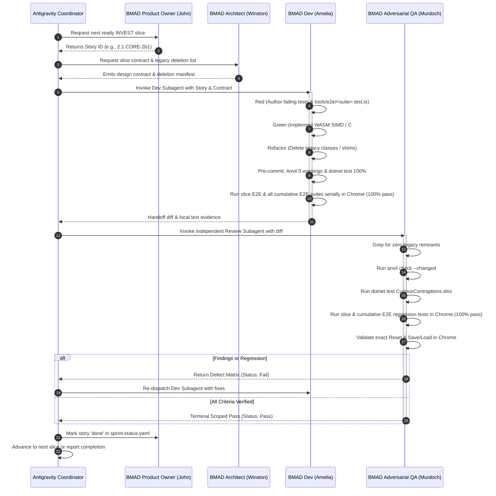

# Autonomous BMAD Development Workflow Guide

## Executive Summary

This guide defines the operational loop for 100% autonomous software delivery in **Curious Contraptions** using the **BMAD Method (Breakthrough Method for Agile AI-Driven Development)** combined with Antigravity agentic orchestration.

It formalizes the **Paired Subagent Workflow (REQ-14)** into four specialized BMAD roles, enforcing forward-only refactoring, strictly zero external physics dependencies, mathematical rigor (Quad-BVH, TGS Soft, speculative contacts), and independent adversarial review.

---

## The Four Core Autonomous Agent Roles

```mermaid
flowchart LR
    PO["1. BMAD Product Owner<br/>(Mary / John)"] -->|"Selects Next Ready INVEST Slice"| ARCH["2. BMAD Solution Architect<br/>(Winston)"]
    ARCH -->|"Designs Data & Deletion Contract"| DEV["3. BMAD Developer<br/>(Amelia - Implementer)"]
    DEV -->|"Submits Diff & Test Proof"| QA["4. BMAD Adversarial QA<br/>(Murdoch - Reviewer)"]
    QA -->|"Terminal Scoped Pass"| SYNC["Sprint Status & Backlog Sync"]
    QA -.->|"Findings / Defect Matrix"| DEV
```

### Role 1: BMAD Product Owner / Analyst (Mary / John)
- **Primary Responsibility:** Inspects `_bmad-output/implementation-artifacts/sprint-status.yaml` and `docs/planning/invest/vertical-delivery.md` to identify the next authorized, unblocked INVEST vertical slice.
- **Rules of Engagement:**
  - Enforces the **4 October Playable-First Policy**: deliver working player interactions first; deferred performance campaigns (P0-034) do not block functional delivery.
  - Ensures slice boundaries are strictly bounded: exactly one player-visible behavior, one data-driven capability, and the legacy it deletes.
  - Transitions story status in `sprint-status.yaml` from `backlog` to `ready-for-dev`.

### Role 2: BMAD Solution Architect (Winston)
- **Primary Responsibility:** Defines the technical contract for the slice in accordance with the Architecture Spine (`_bmad-output/planning-artifacts/architecture.md`).
- **Rules of Engagement:**
  - Preserves Tri-Graph Decoupling: C# Machine Graph $\to$ WASM SIMD flat SoA Physics Graph $\to$ Lock-free SAB triple pose ring $\to$ WebGL 2 / WebGPU instanced rendering.
  - Guarantees **strictly zero external physics dependencies** (no Box2D, no Jolt, no Rapier, no PhysX).
  - Specifies math and algorithms conforming to Jolt patterns: Quad-BVH broadphase, 4-point area-maximizing contact manifold reduction, Box2D v3 TGS Soft compliance ($\gamma, \beta, M_{\text{eff}}$), and speculative contacts anti-tunneling ($v_{\text{target}} = -g/h$).
  - Explicitly identifies every superseded class, method, or shader that must be deleted in this slice (zero backward-compatibility shims).

### Role 3: BMAD Developer / Implementation Specialist (Amelia)
- **Primary Responsibility:** Dedicated implementation subagent that writes production code, deletes legacy assets, and authors automated tests.
- **Rules of Engagement:**
  - Follows strict test-first discipline (red, green, refactor).
  - Authors C# (.NET 10 / Mono) for machine authoring and WASM SIMD, and TypeScript for browser worker integration.
  - Authors reusable, pure TypeScript Playwright E2E tests in `tools/e2e/<suite>.test.ts`.
  - Runs pre-commit checks:
    1. `anvil check --changed` $\implies$ must have **0 warnings**.
    2. `dotnet test CuriousContraptions.slnx` $\implies$ must pass **100%** (557+ tests).
    3. Browser-based E2E verification in Chrome: executes `node --test --test-concurrency=1 --test-timeout=150000 tools/e2e/<suite>.test.ts` AND executes all prior cumulative regression suites serially (`node --test --test-concurrency=1 --test-timeout=150000`) with a **100% pass rate**.
  - **A story CANNOT be marked complete or handed off without authoring and running the corresponding browser-based E2E test in Chrome (`tools/e2e/<suite>.test.ts`) AND running all prior regression E2E test suites serially (`node --test --test-concurrency=1 --test-timeout=150000`).**
  - Hands off completed snapshot to the independent reviewer.

### Role 4: BMAD Adversarial QA / Reviewer (Murdoch)
- **Primary Responsibility:** Dedicated independent adversarial review subagent. **Self-review never qualifies.**
- **Rules of Engagement:**
  - Independently inspects the git diff against all Acceptance Criteria in `_bmad-output/planning-artifacts/epics.md`.
  - Proves zero legacy remnants via codebase grep (e.g. verifying deleted shaders, certificates, or ad-hoc branches are completely absent from active code).
  - Independently executes `anvil check --changed` and `dotnet test CuriousContraptions.slnx`.
  - Executes pure TypeScript Playwright E2E tests in actual Chrome browser via the Playwright connector: runs both the slice's dedicated E2E test (`node --test --test-concurrency=1 --test-timeout=150000 tools/e2e/<suite>.test.ts`) and all preceding cumulative E2E regression suites serially (`node --test --test-concurrency=1 --test-timeout=150000`).
  - Tests exact authoring Reset restoration and Save/Load persistence in Chrome.
  - **Enforces mandatory 100% pass rate across both the slice's E2E test and all cumulative E2E regression suites in Chrome before granting Pass. Any browser failure, timeout, or regression strictly blocks completion.**
  - Issues terminal scoped verdict:
    - **Fail:** Known regression, test failure, browser crash, or broken invariant $\to$ returns findings to Amelia.
    - **Incomplete:** Stale, missing, or unverified proof $\to$ requests required evidence.
    - **Pass:** 100% verified with zero unresolved regressions across unit tests, Anvil, slice E2E test, and all cumulative regression E2E suites in Chrome $\to$ updates `sprint-status.yaml` and signs off.

---

## Mandatory Definition of Done (DoD) & Story Completion Criteria

No story can be marked complete (`done`) in `_bmad-output/implementation-artifacts/sprint-status.yaml` without satisfying all seven mandatory completion criteria:

1. **C# Unit Tests Pass 100%:** `dotnet test CuriousContraptions.slnx` passes 100% with 0 failures (557+ tests).
2. **Anvil Static Analysis Clean:** `anvil check --changed` passes with **0 warnings**.
3. **Browser-Based Playwright E2E Suite Passes 100%:** The story's dedicated browser-based E2E test (`tools/e2e/<suite>.test.ts`) is authored and executed in actual Chrome via the Playwright browser connector with a **100% pass rate**.
4. **Cumulative E2E Regression Suites Pass 100% Serially:** All prior cumulative browser-based E2E regression suites are executed serially in actual Chrome (`node --test --test-concurrency=1 --test-timeout=150000`) and pass 100%. A 100% pass rate across both the slice's E2E test and all cumulative E2E regression suites is mandatory before any story can be marked 'done'. Any browser failure or regression strictly blocks completion.
5. **Exact Reset and Save/Load Persistence Roundtrip:** Exact initial state restoration before Run and after Reset, as well as JSON Save/Load roundtrip, is verified in Chrome.
6. **Zero Legacy Remnants:** Active tree grep confirms complete deletion of superseded classes, compute shaders, or compatibility bridges.
7. **Terminal Scoped Pass from Independent Reviewer (Murdoch):** Independent adversarial review subagent verifies all criteria and issues an unambiguous scoped `Pass`. Self-review never qualifies.

---

## Step-by-Step Autonomous Execution Loop

### Phase 1: Backlog Selection & Readiness
1. Check `_bmad-output/implementation-artifacts/sprint-status.yaml`.
2. Locate the first story marked `ready-for-dev`. If none, locate the first unblocked story in `backlog` from the current in-progress epic.
3. Verify that all genuine technical prerequisites have received a terminal `Pass` from independent review.
4. Update story status to `in-progress`.

### Phase 2: Architectural Contract & Deletion Manifest
1. Review `_bmad-output/planning-artifacts/architecture.md` and `docs/gpu-f16-physics.md`.
2. Formulate the mathematical and architectural invariants for this slice:
   - What data declaration is being added?
   - What equation or constraint formulation is being added/updated?
   - What files/classes are being deleted?
3. Verify that zero backwards compatibility bridges or fallback paths are introduced.

### Phase 3: Test-First Implementation (Amelia)
1. Write/update unit tests in `CuriousContraptions.tests` and author the corresponding browser-based Playwright E2E test in `tools/e2e/<suite>.test.ts`.
2. Implement the forward functionality in C# / WASM SIMD / TypeScript.
3. Delete the superseded legacy code completely.
4. Execute `anvil check --changed`. Fix all warnings until **0 warnings** remain.
5. Execute `dotnet test CuriousContraptions.slnx`. Ensure all tests pass **100%** (557+ tests).
6. Execute the browser-based Playwright E2E test in actual Chrome via the Playwright connector: `node --test --test-concurrency=1 --test-timeout=150000 tools/e2e/<suite>.test.ts`.
7. Execute all prior cumulative regression E2E test suites serially in actual Chrome: `node --test --test-concurrency=1 --test-timeout=150000 tools/e2e/*.test.ts`.
8. **Enforce DoD requirement:** A story CANNOT be marked complete or handed off to review without authoring and running the corresponding browser-based E2E test in Chrome (`tools/e2e/<suite>.test.ts`) AND running all prior regression E2E test suites serially (`node --test --test-concurrency=1 --test-timeout=150000`). A **100% pass rate** across both the slice's E2E test and all cumulative E2E regression suites is mandatory before any story can be marked 'done'.
9. Commit changes to git with a clear, concise commit message.

### Phase 4: Independent Adversarial Review (Murdoch)
1. The coordinator invokes a separate, independent subagent conversation for Murdoch.
2. Murdoch reads the git diff and the specific story acceptance criteria from `epics.md`.
3. Murdoch runs automated static checks:
   - `anvil check --changed` (0 warnings required)
   - `dotnet test CuriousContraptions.slnx` (100% pass required)
4. Murdoch runs active grep searches to ensure zero legacy references remain.
5. Murdoch runs browser-based E2E verification in actual Chrome via the Playwright browser connector:
   - Runs the slice's dedicated E2E test: `node --test --test-concurrency=1 --test-timeout=150000 tools/e2e/<suite>.test.ts`.
   - Runs all prior cumulative regression E2E test suites serially: `node --test --test-concurrency=1 --test-timeout=150000`.
   - Verifies visual behavior, dynamic stability, anti-tunneling, and negative controls.
   - Verifies that pressing Reset restores the original configuration bit-for-bit, and Save/Load roundtrip preserves state.
   - **Enforces DoD requirement:** A story CANNOT be marked complete without authoring and running the corresponding browser-based E2E test in Chrome AND running all prior regression E2E test suites serially. A **100% pass rate** across both the slice's E2E test and all cumulative E2E regression suites is mandatory before any story can be marked 'done'. Any browser failure or regression strictly blocks completion and triggers a `Fail` verdict.
6. Murdoch renders the final verdict: `Pass`, `Fail`, or `Incomplete`.

### Phase 5: Sprint Sync & Completion
1. **Enforce DoD check:** A story CANNOT be marked complete without authoring and running the corresponding browser-based E2E test in Chrome (`tools/e2e/<suite>.test.ts`) AND running all prior regression E2E test suites serially (`node --test --test-concurrency=1 --test-timeout=150000`), with a 100% pass rate across both the slice's E2E test and all cumulative regression suites, alongside Murdoch's terminal scoped `Pass`.
2. Upon receiving `Pass`, update `_bmad-output/implementation-artifacts/sprint-status.yaml`:
   - Set the completed story to `done`.
   - Set the next story in the epic to `ready-for-dev`.
   - If all stories in the epic are `done`, set the epic to `done`.
3. Update `TODO.md` with delivered results, test command evidence, and next slice.
4. Proceed to the next slice in the rolling roadmap.

---

## Standing Quality Gates & Enforcement Commands

| Gate | Tool / Command | Passing Threshold | Blocking Condition |
| :--- | :--- | :--- | :--- |
| **Static Code Quality** | `anvil check --changed` | **0 warnings** | Any warning blocks review |
| **Unit & Regression** | `dotnet test CuriousContraptions.slnx` | **100% Pass** (0 failed, 557+ passed) | Any test failure blocks review |
| **Browser-Based E2E Gate** | `node --test --test-concurrency=1 --test-timeout=150000 tools/e2e/<suite>.test.ts` (and all prior cumulative regression suites) | **100% Pass across all tests in Chrome** (serial runs) | Any browser failure or regression strictly blocks completion |
| **Zero Legacy Verification**| `git grep "<superseded_symbol>"` | **0 matches** in active code | Any active reference blocks review |
| **Exact State Reset** | Browser E2E Playwright assertion in Chrome | Bitwise / coordinate match before Run and after Reset | Pose drift or dirty state blocks review |
| **Format & Build Cleanliness** | `dotnet build CuriousContraptions.slnx` | **0 errors, 0 warnings** | Build failure blocks review |
