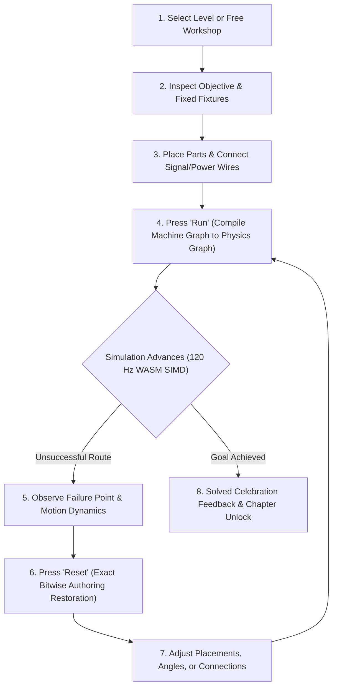

# Product Requirements Document (PRD) — Curious Contraptions

**Document Version:** 1.0.0  
**Status:** Approved / Authoritative  
**Method:** BMAD Product Specification Standard  
**Product:** Curious Contraptions  
**Author:** Winston (BMAD Process & Architecture Specialist)

---

## 1. Executive Summary & Vision

**Curious Contraptions** is a modern, browser-native physics puzzle sandbox and progressive challenge game inspired by classics such as *The Incredible Machine* and *Crazy Machines*. Players construct whimsical, intricate chain-reaction contraptions on a 3D workbench to accomplish playful objectives—routing bowling balls into buckets, igniting laser circuits to pop balloons, triggering domino cascades, powering conveyor belts, and sounding musical chimes.

Built with an uncompromising technical standard, Curious Contraptions runs universally across modern web browsers without plugins, external installations, or external third-party physics engine dependencies (strictly zero Box2D, Jolt, Rapier, or PhysX). The entire simulation engine is custom-authored in pure C# (.NET 10 / Mono) and TypeScript, compiled to 128-bit WebAssembly SIMD (`wasm-simd128`), and executed on a dedicated Web Worker at a rock-solid 120 Hz. Visuals are powered by universal instanced rendering (WebGL 2.0 and WebGPU) driven by a lock-free `SharedArrayBuffer` triple pose ring, complemented by an independent 60 Hz WebAssembly animation worker.

The result is a deterministic, game-grade, delightfully tactile contraption builder capable of simulating hundreds of interacting bodies, complex pneumatic flows, electrical logic circuits, and optical ray paths with sub-millisecond execution times.

---

## 2. Core User Experience & Gameplay Loops

### 2.1 The Core Gameplay Loop

1. **Authoring Mode:** The player inspects the workbench in a 3D isometric view. The player can pan, orbit, and zoom around the workbench. Using intuitive mouse or touch controls, the player drags puzzle elements from the catalogue inventory onto the workbench, rotates them along coordinate axes, adjusts configurable sliders (e.g. spring preload, delay seconds, motor speed), and connects typed sockets with signal wires, power cables, and pulleys/ropes.
2. **Run Compilation:** The player clicks the **Run** button. The main thread machine graph immediately compiles into a flat, Structure-of-Arrays (SoA) physics graph dispatched to the simulation worker.
3. **Observation & Dynamics:** The simulation runs live at 120 Hz. The player watches dynamic rigid-body interactions, bouncing balls, toppling dominoes, spinning motors, and optical beams.
4. **Reset Restoration:** Clicking **Reset** immediately halts the simulation worker, wipes runtime state, and restores the authoring scene bit-for-bit to its exact pre-run configuration. No positional drift, residual momentum, or dirty states can persist.
5. **Solved Feedback:** When level victory conditions are satisfied (e.g. Ball captured in Receiver, target balloon popped, all chimes rung in sequence), the level triggers a celebratory fanfare, awards star completion, and unlocks the next level.

---

### 2.2 Game Modes

#### Mode A: The 150-Level Progressive Campaign
A meticulously designed 150-level pedagogical journey structured across **5 Progressive Chapters** (30 levels per chapter, delivered in structured 10-level increments):
- **Chapter 1: "On a Roll" (Levels 1–30):** Teaches fundamental mechanics—gravity, spherical inertia, bouncing basketballs, inclined ramps, barrier deflection, impact switches, signal lamps, and receiver capture dwell.
- **Chapter 2: "Chain Reactions" (Levels 31–60):** Introduces dynamic polyhedral bodies (dominoes), radial bumpers, springboard sliders, aperture detectors, pneumatic fans, and multistage timing delays.
- **Chapter 3: "Power & Motion" (Levels 61–90):** Unlocks supplied electrical networks, battery power sources, logic gates (AND, OR, NAND, NOR, XOR), electric motors, conveyor belts, clutches, pulleys, counterweights, and toy cannons.
- **Chapter 4: "Light & Sound" (Levels 91–120):** Introduces optical and acoustic systems: flashlights, lasers, mirrors, beam splitters, spectral color filters (Red, Green, Blue), tuned optical receivers, solar panels, service bells, audio speakers, and wind chimes.
- **Chapter 5: "Master Contraptions" (Levels 121–150):** Grandmaster puzzle challenges combining all 7 physical families into multifaceted, Rube Goldberg machines demanding precise sequencing, logical deduction, and spatial ingenuity.

#### Mode B: Free Workshop Sandbox
An unrestricted creative sandbox mode with unlimited workspace dimensions, all 72 puzzle elements unlocked, customizable gravity and friction presets, multi-slot `SharedArrayBuffer` pose buffers, and full JSON Save/Load export and import.

---

### 2.3 Player Assistance & Accessibility Systems

1. **Puzzle Precision Slider (Difficulty Profiles):**
   - **Forgiving Profile:** Spatial assistance force fields apply gentle guiding forces near goal receivers and ramps; capture tolerances are broadened.
   - **Balanced Profile (Default):** Subtle natural damping with standard capture dwell margins.
   - **Precise Profile:** Zero artificial guiding forces; strict geometric and velocity tolerances for purist simulation fans.
   *Crucial Invariant:* Assistance fields are modeled strictly as declared spatial acceleration fields in the physics compiler. They never move physical collider geometry, teleport bodies, or alter conservation laws.
2. **Progressive Hint System:**
   - **Level 1 (Concept):** Gentle textual riddle highlighting the principle at play.
   - **Level 2 (Inventory Hint):** Highlights which inventory parts should interact.
   - **Level 3 (Ghost Blueprint):** Shows semi-transparent ghost outlines for critical part placements on the workbench without giving away wire routings.
3. **Camera & Spatial Controls:**
   - Smooth 3D orbiting, panning, and zooming with camera framing presets (Overview, Focus Element, Follow Ball).
   - Workbench grid snap toggles (0.1m, 0.25m, 0.5m, free placement) and 15° rotational snapping.

---

## 3. Complete Catalogue of 72 Puzzle Elements

Every puzzle element is implemented purely as declarative capability data without bespoke solver branches or hardcoded tick loops. The 72 elements are grouped into 7 functional and physical families:

### Family 1: Mechanical Contact & Rigid Bodies (12 Elements)
| Element ID | Catalogue Identity | Element Name | Description & Capabilities |
| :--- | :--- | :--- | :--- |
| **CAT-001** | `ball` | **Basketball** | Standard dynamic sphere (mass 0.6 kg, radius 0.12 m, restitution 0.75, drag 0.1). Canonical bouncing payload. |
| **CAT-004** | `basket` | **Receiver** | Bounded capture receptacle with physical walls, aperture sensor, and authored residence dwell timer (0.35 s). |
| **CAT-014** | `bowling` | **Bowling Ball** | Heavy dynamic sphere (mass 7.2 kg, radius 0.11 m, restitution 0.15). Imparts massive momentum to topple heavy obstacles. |
| **CAT-064** | `tennis` | **Tennis Ball** | Lightweight high-restitution sphere (mass 0.057 kg, radius 0.033 m, restitution 0.85). Highly susceptible to airflow and springs. |
| **CAT-003** | `balloon` | **Floating Balloon** | Buoyant deformable sphere (net negative gravity $-1.2\text{ m/s}^2$, high aerodynamic drag). Rises until blocked or popped. |
| **CAT-023** | `domino` | **Domino** | Dynamic rectangular polyhedral body (3x3 inertia tensor, 4-point contact manifold). Stands upright; cascades when struck. |
| **CAT-054** | `ramp` | **Ramp** | Fixed or adjustable inclined plane with affine SAT contact manifold. Guides rolling balls down slopes. |
| **CAT-066** | `wall` | **Wall** | Fixed rectangular obstacle with 3D local-axis resizing handles. Deflects moving bodies and blocks airflow/sound/light. |
| **CAT-030** | `funnel` | **Funnel** | Tapered conical collector with hollow interior collider that guides falling balls into a concentrated vertical exit. |
| **CAT-048** | `pipe` | **Straight Pipe** | Cylindrical hollow tube compound collider. Encloses rolling balls along a linear guide path. |
| **CAT-049** | `pipe_bend_45`| **45° Pipe Bend** | Toroidal segment compound collider redirecting enclosed rolling balls through a 45-degree angle. |
| **CAT-050** | `pipe_bend_90`| **90° Pipe Bend** | Toroidal segment compound collider redirecting enclosed rolling balls through a 90-degree right angle. |

### Family 2: Activation, Sensors & Discrete Logic (9 Elements)
| Element ID | Catalogue Identity | Element Name | Description & Capabilities |
| :--- | :--- | :--- | :--- |
| **CAT-002** | `ball_detector`| **Ball Detector** | Aperture crossing sensor with directional rearm. Fires a single discrete pulse when a body passes through in the forward direction. |
| **CAT-063** | `switch` | **Impact Switch** | Push-button contact sensor. Latches or pulses upon physical impact exceeding an authored force threshold. |
| **CAT-052** | `pressure_plate`| **Pressure Plate** | Surface contact load sensor. Remains closed/active while a body rests on its top plate with mass $> 0.2\text{ kg}$. |
| **CAT-035** | `lamp` | **Signal Lamp** | Visual activation indicator with latched or momentary states. Emits cosmetic glow via animation worker. |
| **CAT-022** | `delay` | **Delay Box** | Signal buffer that delays an incoming activation pulse by an authored duration (0.1 s to 10.0 s). Visual progress fill. |
| **CAT-020** | `counter` | **Pulse Counter** | Digital event accumulator. Emits an output pulse once an authored input pulse count ($N = 1..10$) is reached. |
| **CAT-017** | `clock` | **System Clock** | Periodic pulse generator with configurable interval (0.2 s to 5.0 s). Drives synchronized contraption sequences. |
| **CAT-037** | `latch` | **State Latch** | Set/Reset bistable memory latch (SR flip-flop). Reset dominant for same-tick conflicts. Preserves state across ticks. |
| **CAT-033** | `hold_timer` | **Hold Timer** | One-shot pulse stretcher. Incoming trigger closes output contact for a configured hold duration (0.1 s to 12.0 s). |

### Family 3: Supplied Electrical Power & Logic (6 Elements)
| Element ID | Catalogue Identity | Element Name | Description & Capabilities |
| :--- | :--- | :--- | :--- |
| **CAT-005** | `battery` | **Battery** | Direct current electrical power source (12 V rated). Supplies power to active electrical circuits and motors. |
| **CAT-013** | `both_gate` | **Dual-Supply Both** | Electrical dual-power AND gate. Conducts current only when both independent input circuits provide active supply. |
| **CAT-024** | `electrical_nand`| **Electrical NAND** | Boolean NAND logic gate. Conducts power when NOT both inputs are energized. |
| **CAT-025** | `electrical_nor` | **Electrical NOR** | Boolean NOR logic gate. Conducts power only when neither input is energized. |
| **CAT-026** | `electrical_or` | **Electrical OR** | Boolean OR logic gate. Conducts power when either input is energized. |
| **CAT-027** | `electrical_xor` | **Electrical XOR** | Boolean XOR logic gate. Conducts power when exactly one input is energized. |

### Family 4: Constrained Mechanics & Elastic Fixtures (7 Elements)
| Element ID | Catalogue Identity | Element Name | Description & Capabilities |
| :--- | :--- | :--- | :--- |
| **CAT-062** | `spring` | **Springboard** | 1D prismatic slider with compliant TGS Soft spring constraint, configurable preload, and mechanical travel limits. |
| **CAT-015** | `bumper` | **Pinball Bumper** | Circular kinetic repulsor. Imparts radial impulse from a finite work store upon contact; debits energy on each impact. |
| **CAT-065** | `trampoline` | **Trampoline** | Compliant membrane surface with tension and damping. Yields under payload and rebounds elastically with zero artificial gain. |
| **CAT-034** | `impact_lever` | **Impact Lever** | Rigid beam pivoted on a fulcrum with finite rotational inertia, end stops, and rope attachment sockets. Balanced seesaw. |
| **CAT-053** | `pulley` | **Pulley** | Low-friction rotary wheel that redirects connected rope tension vectors around its rim. |
| **CAT-067** | `weight` | **Counterweight** | Heavy spherical mass with rope socket for lifting assemblies, counterbalances, or 3D pendulums. |
| **CAT-058** | `rope_anchor` | **Rope Anchor** | Fixed rigid anchor point supporting tensile rope connections across the workbench. |

### Family 5: Rotary Drive & Mechanical Actuators (9 Elements)
| Element ID | Catalogue Identity | Element Name | Description & Capabilities |
| :--- | :--- | :--- | :--- |
| **CAT-042** | `motor` | **Electric Motor** | Rotary actuator driven by electrical power. Spins output axle at configurable angular velocity (0 to 20 rad/s). |
| **CAT-019** | `conveyor` | **Conveyor Belt** | Motor-driven moving belt surface. Imparts continuous tangential surface velocity to resting bodies. |
| **CAT-018** | `clutch` | **Mechanical Clutch**| Rotary coupling mechanism. Connects or disconnects drive shafts based on a signal activation state. |
| **CAT-057** | `reverse_transmission`| **Reverse Transmission**| Inverting gearbox. Reverses rotation direction between input and output axles with a 1:1 ratio. |
| **CAT-039** | `linear_pusher`| **Linear Pusher** | Electrically powered telescopic piston. Extends and retracts a rigid pusher head with configurable stroke and force. |
| **CAT-051** | `powered_gate` | **Powered Gate** | Motorized barrier that slides or swings open upon electrical or signal activation, unblocking physical passageways. |
| **CAT-071** | `wound_spring` | **Wound Spring Motor**| Mechanical potential energy store. Winds up via mechanical rotation or ratchets; releases stored work upon trigger. |
| **CAT-016** | `cannon` | **Toy Cannon** | Spring-plunger ball launcher. Chamber locks loaded ball and fires with high muzzle velocity upon trigger pulse. |
| **CAT-007** | `beam_shutter`| **Beam Shutter** | Mechanical guillotine blade actuated by signal or rope. Physically intercepts and blocks optical light beams. |

### Family 6: Conserved Airflow & Pneumatics (3 Elements)
| Element ID | Catalogue Identity | Element Name | Description & Capabilities |
| :--- | :--- | :--- | :--- |
| **CAT-028** | `fan` | **Electric Fan** | Motorized bladed fan that produces a directed conical airflow jet. Exerts aerodynamic drag forces on nearby light bodies. |
| **CAT-010** | `bellows` | **Pneumatic Bellows**| Mechanical compression chamber. Compressing plates discharges a high-velocity burst of air through a focused nozzle. |
| **CAT-070** | `windmill` | **Windmill Generator**| Bladed rotor that captures incoming airflow forces, spinning an axle to produce mechanical or electrical output power. |

### Family 7: Optical & Acoustic Propagation (26 Elements)
| Element ID | Catalogue Identity | Element Name | Description & Capabilities |
| :--- | :--- | :--- | :--- |
| **CAT-029** | `flashlight` | **Flashlight Torch** | Wide-angle divergent white light source with inverse-square intensity attenuation. |
| **CAT-036** | `laser` | **Laser Emitter** | Collimated monochromatic linear-RGB optical beam emitter with infinite reach and zero spread. |
| **CAT-041** | `mirror` | **Flat Mirror** | Planar optical reflector that reflects incident light beams according to the law of reflection ($\theta_{\text{reflect}} = \theta_{\text{incident}}$). |
| **CAT-008** | `beam_splitter` | **Beam Splitter** | Half-silvered optical cube that splits an incident beam into a 50% transmitted beam and a 50% 90° reflected beam. |
| **CAT-006** | `beam_combiner` | **Beam Combiner** | Optical prism that merges two orthogonal incident light beams into a single co-linear composite beam. |
| **CAT-011** | `blue_filter` | **Blue Filter** | Spectral bandpass filter pane. Passes only blue wavelength photons; absorbs red and green. |
| **CAT-031** | `green_filter`| **Green Filter** | Spectral bandpass filter pane. Passes only green wavelength photons; absorbs red and blue. |
| **CAT-055** | `red_filter` | **Red Filter** | Spectral bandpass filter pane. Passes only red wavelength photons; absorbs green and blue. |
| **CAT-038** | `light_receiver`| **Broadband Light Receiver**| Front-facing optical sensor. Closes electrical contacts when incident illumination exceeds threshold. |
| **CAT-012** | `blue_receiver` | **Blue Receiver** | Tuned optical detector. Activates only when incident light contains $\ge 90\%$ pure blue spectral energy. |
| **CAT-032** | `green_receiver`| **Green Receiver** | Tuned optical detector. Activates only when incident light contains $\ge 90\%$ pure green spectral energy. |
| **CAT-056** | `red_receiver` | **Red Receiver** | Tuned optical detector. Activates only when incident light contains $\ge 90\%$ pure red spectral energy. |
| **CAT-021** | `cyan_receiver` | **Cyan Receiver** | Tuned optical detector. Activates when incident light contains both blue and green spectral energy. |
| **CAT-040** | `magenta_receiver`| **Magenta Receiver**| Tuned optical detector. Activates when incident light contains both red and blue spectral energy. |
| **CAT-072** | `yellow_receiver`| **Yellow Receiver**| Tuned optical detector. Activates when incident light contains both red and green spectral energy. |
| **CAT-068** | `white_receiver`| **White Receiver** | Tuned optical detector. Activates when incident light contains red, green, and blue spectral energy simultaneously. |
| **CAT-059** | `solar_panel` | **Solar Panel** | Photovoltaic receiver plate. Converts incident optical flux directly into electrical output power. |
| **CAT-043** | `optical_and` | **Optical AND Gate** | Optical crystal gate emitting a beam only when two distinct optical beams illuminate its inputs. |
| **CAT-044** | `optical_nand`| **Optical NAND Gate**| Optical crystal gate emitting a beam when NOT both optical inputs are illuminated. |
| **CAT-045** | `optical_nor` | **Optical NOR Gate** | Optical crystal gate emitting a beam only when neither input is illuminated. |
| **CAT-046** | `optical_or` | **Optical OR Gate** | Optical crystal gate emitting a beam when either optical input is illuminated. |
| **CAT-047** | `optical_xor` | **Optical XOR Gate** | Optical crystal gate emitting a beam when exactly one optical input is illuminated. |
| **CAT-009** | `bell` | **Service Bell** | Acoustic percussion fixture. Rings with a crisp metallic chime when struck by a body with sufficient impulse. |
| **CAT-061** | `speaker` | **Audio Speaker** | Electro-acoustic transducer. Emits directional acoustic pressure pulses upon electrical activation. |
| **CAT-060** | `sound_meter` | **Sound Level Meter** | Acoustic sensor. Detects incoming acoustic waves and closes an electrical circuit when volume exceeds threshold. |
| **CAT-069** | `wind_chimes` | **Wind Chimes** | Multi-tube resonant chime array. Oscillates and chimes when struck by airflow from fans or direct collisions. |

---

## 4. Non-Negotiable Technical Constraints & Architectural Invariants

1. **Zero External Physics Dependencies:**
   - Strictly 0 external libraries: no Box2D, no Jolt, no Rapier, no PhysX, no Ammo.js, no Cannon.js.
   - 100% in-engine algorithms written in clean C# and TypeScript conforming to canonical mathematical formulations:
     - 4-wide SIMD Dynamic AABB BVH broadphase with velocity fattening.
     - 15-axis SAT narrowphase with 4-point area-maximizing contact manifold reduction.
     - Box2D v3 Temporal Gauss-Seidel (TGS) Soft solver with compliance $\gamma$ and softness $\beta$.
     - Speculative contacts anti-tunneling CCD ($d_{\text{spec}} = |\mathbf{v}_{\text{rel}} \cdot \mathbf{n}| \, h + s_{\text{slop}}$, $v_{\text{target}} = -g/h$).
     - Disjoint Set Union (DSU) island partitioning with zero-cost sleeping.
2. **Tri-Graph Decoupling:**
   - **Machine Graph (Main Thread):** Hierarchical authoring, socket wiring, JSON persistence, and UI.
   - **Physics Graph (WASM SIMD Worker @ 120 Hz):** Flat contiguous 64-byte aligned SoA tables; 480 Hz substep integration. Lock-free `SharedArrayBuffer` triple pose ring publishing.
   - **Rendering Graph (Main Thread @ 30–60 FPS):** Universal instanced draw batches on WebGL 2 and WebGPU consuming pose ring buffers directly.
   - **Animation Worker (WASM Worker @ 60 Hz):** Procedural cosmetic curves and halo pulses; fed one-way by physics events.
   - **Data Flow:** One-way only: Physics $\to$ Animation $\to$ Renderer. Zero reverse data flow or synchronous waits.
3. **Forward-Only Refactoring & Zero Backwards Compatibility:**
   - Zero backward-compatibility shims, legacy flags, or parallel CPU fallback paths.
   - Git history is the permanent archive. When a forward capability lands, superseded code is deleted in the exact same PR/slice.
4. **Mandatory Quality Gates for Every Single Story (DoD):**
   - C# Unit tests pass 100% (`dotnet test CuriousContraptions.slnx`, 557+ tests).
   - Anvil static analysis clean with **0 warnings** (`anvil check --changed`).
   - Browser-based E2E Playwright test in actual Chrome passes 100% (`node --test --test-concurrency=1 --test-timeout=150000 tools/e2e/<suite>.test.ts`).
   - All preceding cumulative E2E regression suites pass 100% serially in Chrome.
   - Exact Reset restoration and Save/Load persistence verified in Chrome.
   - Zero legacy remnants verified via codebase grep.
   - Independent adversarial reviewer (Murdoch) terminal scoped `Pass`.
