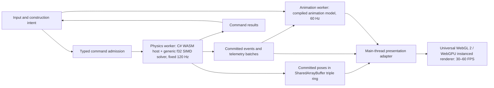

# Simulation–presentation bridge

The bridge is the one-way data path between the three execution systems fixed by the [compilation model](gpu-f32-physics.md#compilation-model) and the [engine contracts](engine-contracts.md#general-data-driven-engines): the **physics worker** (C# WebAssembly host plus generic WASM SIMD128 f32 solver over the compiled initial state, fixed 120 Hz tick with 480 Hz substeps), the **animation worker** (its own compiled model from the same element data, its own clock, currently 60 Hz) and the **renderer** on the browser main thread (display-paced, 30–60 FPS under [REQ-02](delivery-workflow.md#standing-requirements), universal WebGL 2 and WebGPU instanced draw batches). Data flows physics → animation → renderer and physics → renderer; nothing flows back, no state is shared mutably, and rates are ordered physics > animation ≥ renderer. Implementation status is in [TODO](../TODO.md). Tracking IDs PERF-06 and PERF-31–48 own this boundary and P0-035 engine closure is the release gate that repeats its full qualification; the [visual contract](../DESIGN.md) owns appearance.

## Decision and boundaries

Typed commands change canonical IEEE-754 f32 game state through the dedicated physics Web Worker, whose C# host owns discrete transactions, spatial queries, and continuous physical state. Committed snapshots and events cross bounded message transport to the separate C# animation worker and to the browser-thread presentation adapter. This command/read boundary needs no event sourcing, database or broker.

The physics worker owns bodies, shapes, materials, constraints, force regions, stores, sources, sensors, network state, controllers, pending events and lifecycle for every domain the game uses. It knows no mesh, material resource, camera, DOM node or animation implementation. A host coordinator handles user intent and lifecycle orchestration; a generic adapter binds typed identities and observables to presentation assets through the [declared bindings](presentation-bindings.md). No per-element solver, kernel branch, equation table or update loop exists in any context, including the bridge; element declarations feed the shared solver and the shared animation evaluators.

The [gameplay lifecycle criteria](planning/requirements.md#sequence-task-145) require complete transaction coverage; a reentrancy guard alone is insufficient. Validate the current caller inventory and restoration of every enrolled operation before claiming atomic publication.

The same bridge serves mechanics, heat, fluid/gas, electrical state, optical paths, acoustic pulses, force regions and radiation exposure. Read contracts expose physical observables with units and typed identities; the adapter maps them to colour, mesh deformation, symbols or audio. Arbitrary property bags, string-keyed topics, concrete-part dispatch and hidden executable payloads are not a generic contract.

## Numeric authority and lock-free shared memory boundary

The [numeric contract](gpu-f32-physics.md) governs canonical IEEE-754 f32 values, quantized cell-relative origin representation during authoring, SIMD128 vectorization, and lock-free atomic triple-buffered pose publication in `SharedArrayBuffer`. Editor controls, content, construction saves, animation/read models and fixtures use typed f32 values. Save is construction-only and Reset restores canonical admitted bits exactly. Elimination of GPU-to-CPU readback stalls (`mapAsync` stalls) is guaranteed by the lock-free pose ring: the simulation worker writes committed body transforms and velocities directly into pre-allocated shared memory slots, which the browser renderer reads in its display loop without blocking or allocations. Same-build replay on the same machine gives the same outcome; cross-device comparison uses the [game-grade envelope](gpu-f32-physics.md#game-grade-envelope), while IDs and events remain exact.

## Command contract

Represent operations with enum-typed discriminants and compiler-checked payload types. Use strongly typed command, entity, body, connection, world-generation and revision IDs, and integer ticks/sequences. A command envelope includes protocol version, target generation, ordering information and any required expected revision; record the applied simulation tick, phase and deterministic order in its result/replay record. Preserve signed and unsigned 64-bit identities losslessly across C# and JS boundaries. Golden round-trip/rejection vectors must cover values around 2^53, integer maxima, zero/default values, overflow, malformed lengths and unknown enum values. Simulation events and rejected-command reasons remain enums through callers, collections and tests; serialize only at validated external boundaries.

Commands express intent: create/move an authored assembly in construction mode, connect compatible ports, set a supported controller input, Run, Pause, Step, Resume, Reset, Save or Load. They are not arbitrary setters for physical velocity, temperature or energy. A generic capability may accept a validated physical boundary input, but the presentation layer cannot invent it to obtain a desired outcome.

Separate admission from application. Admission checks shape/schema and queue capacity; the physics owner validates current topology, permissions/mode, capability and revision immediately before application. Acceptance into the queue is not evidence that the operation committed. Publish a typed result identifying the command and committed revision or explicit rejection reason.

Assign deterministic order within an explicit application boundary: construction edits commit while Building at an idle boundary; runtime control changes apply at defined ticks/phases. Specify target-tick and late-arrival policy where scheduling is exposed. Exact replay compares the same commands at the same applied ticks, phases and order; identical command order with different arrival/application times is not an equivalent input history. Preserve dependent action order and never Run ahead of accepted placement/link changes.

Reject stale-generation and incompatible stale-revision commands explicitly. Repeated command IDs must not repeat their effects: retain a bounded result/sequence contract, with explicit rejection outside the supported acknowledgement window. A cancellation request can cancel only pending work; it cannot undo an already committed physical action.

Coalesce only explicitly replaceable pending intent, such as successive updates to the same drag preview within one edit session. Do not merge pulses, releases, connect/disconnect, Run/Reset/Load or commands separated by a dependent action. Responsive ghost previews are presentation-only until their construction command is acknowledged.

## Committed read model and query services

Publish a compact snapshot after the entire gameplay tick transaction succeeds. Include generation, committed tick/revision and simulation time, stable topology/resource binding revisions, poses and requested domain telemetry. Include sufficient previous/current state for interpolation and reconstruction after a skipped render frame. Never expose live solver objects, mutable dictionaries or pooled spans with an unspecified lifetime.

Snapshots are immutable to readers. Transfer buffers have one owner and bounded acquire/release/recycle lifetimes; generation and sequence validation precedes application. Retained captures require owned storage. Qualify transport slots, acknowledgements, copied bytes and backpressure before cutover; do not copy the complete solver world each frame.

Publish one coherent revision across domains. Physical events, topology, poses and quantities must not come from different commits. Apply create/remove/rebind information before state that refers to those identities; reject stale handles with generation checks. Reset and restoration discontinuities reseed both displayed states rather than interpolating across them.

Dirty lists can reduce node writes and uploads. If transport uses deltas, each delta must name its base revision and the consumer must validate it. Skipping an intermediate delta cannot lose an unchanged field; rebuild from a complete snapshot when needed. Pack bounded typed batches into explicitly owned transferable buffers; include actual .NET-to-JS copies in the budget and never expose a live managed heap view across runtimes. No per-frame JSON, reflection or message allocation per body.

Read-only authoritative queries are a separate typed service for placement validation, physical picking/inspection and save barriers. Batch queries and stamp results with the generation/revision they describe. Preview reads may lag; any subsequent mutation revalidates against authoritative state. Interpolated graphics may support cosmetic picking, but cannot decide collision validity, sensor activation or persisted physical state.

## Event delivery and backpressure

Separate replaceable state from nonreplaceable occurrences. The renderer may skip intermediate pose snapshots when it has a coherent recent interpolation pair. It must not lose a short pulse, impact, trigger result, command acknowledgement or entity deletion just because no frame was drawn.

Commit events with the corresponding state and stamp them with typed identity, sequence, tick/time and generation. Presentation consumes each committed occurrence at most once according to explicit cursors; replayed delivery does not repeat audio/release feedback. Internal physical consumers execute within the physics schedule; they do not depend on the graphics event queue being drained.

Define bounded capacities and observable high-water marks for command, result and event channels. Reserve publication capacity before a transaction or retain its publication record safely; never commit physical state and then silently discard required output. On saturation, stop admitting affected work or pause at a committed boundary with explicit status while the host continues servicing input/presentation. Reset/Load can still be requested; control handling must not deadlock behind an undrainable queue.

This is a bounded in-memory lifecycle contract, not durable event sourcing. Ordinary save data remains an authoritative construction snapshot. If replay history is offered later, it has its own retention and deterministic-state contract.

## Transaction, Reset and save semantics

For a gameplay tick: obtain the admitted boundary inputs, run the solver substeps and resolve coupled transfers, commit all owned state, then publish its snapshot, events and command results. Precommit failure restores the complete pre-transaction state and publishes no partial poses or success notifications; numerical residuals inside the [game-grade envelope](gpu-f32-physics.md#game-grade-envelope) clamp or continue and never fail a tick. Error reporting is separate from committed physical events.

What the player's controls do: **Run** compiles and captures the exact authored construction, starts tick zero and begins committing ticks. **Pause** freezes world time at the last committed endpoint; **Resume** continues from it without counting paused elapsed time; **Step** advances exactly one tick while paused. **Reset** returns to Building with the pre-Run construction and typed connections restored bit-exactly, cancelling stale effects. **Save** stores the exact canonical construction only (never runtime poses) while Building; **Load** validates before replacing the construction and preserves the prior construction on failure. Reset/Load are lifecycle barriers applied at an idle committed boundary; successful replacement advances generation, invalidates old pending commands/query results/events and establishes a complete new snapshot. Return explicit outcomes for commands invalidated by the barrier.

Do not replay old transient effects after Reset or attach old results to a newly reused body index. Test lifecycle changes while commands/events are pending, during a render frame with no physics tick, and after multiple ticks without a render frame.

## Independent animation system

Animation is a separate presentation service, not a physics subsystem. The animation worker compiles its own model from the same element declarations and the player's initial state, evaluates it on its own clock (currently 60 Hz, [REQ-03](delivery-workflow.md#standing-requirements)) and owns visual phase, clips, procedural loops, easing, transitions, effect lifetimes and animation clocks. Physics owns only physically meaningful motion and state. Committed physics results flow one way into animation inputs; animation never writes physical state, and the two never share a kernel, loop or mutable buffer.

Every element's cosmetic motion is declaration data: typed tracks/curves, transitions, physical-observable/event bindings and target bindings consumed by the shared evaluators ([presentation bindings](presentation-bindings.md)). A motor's decorative spinning mesh declares a repeating track; it needs no simulated rotor, angular-travel history or motor-specific loop. Missing behaviour extends a shared evaluator within its consuming slice; a new element adds bindings, art and curve values only. Slice ANIM-1c deleted the last legacy evaluators (`engine/presentation/Scene*.cs`, `ScalarExtentDefinition` and the `ui/*` visual helpers); the renderer consumes only the pose ring and the animation worker channel through declared part and UI bindings ([presentation bindings](presentation-bindings.md#declared-cosmetic-curves-anim-1b-and-ui-bindings-anim-1c)).

Use typed drive modes for autonomous cosmetics, UI-driven effects, optional physical event/state feedback and authoritative-pose presentation. Animation does not require physics input: UI attention, selection and ambient loops can run with no world or while physics is paused. State-informed effects may consume active/direction or signed speed without owning the physical state. An event-triggered recoil remains animation, not a spring simulation merely because an impact triggered it.

A genuine lever contact surface, pusher head or moving shield still displays its committed physical pose. Compose decorative offsets on presentation-only child nodes where safe; never animate a functional surface through an obstacle or change optical/field geometry through artwork.

Assign one writer per visual property. The adapter binds physical poses and optional semantic signals; the animation service controls cosmetic channels; composition resolves their transforms deterministically before drawing. Do not store cosmetic phase in physics snapshots, force it into the physics event scheduler, or feed an animated transform back into authoritative queries.

Declare clock/lifecycle policies explicitly under the [shared clock](shared-clock-cadence.md): monotonic session time for autonomous effects, committed world time for feedback that needs it, and clear pause/step/success/hidden-tab behaviour. Worker timer callbacks wake evaluation but do not define elapsed time. Publish timestamped samples and evaluate independently of render callbacks. Reset/Load cancels stale effects and restores the visual baseline by generation; physical save/replay needs no cosmetic phase. Respect reduced-motion preferences without altering physical behaviour. Offscreen or inactive loops can stop updating when no visible dependency exists and resume at the policy's current phase; active cosmetics still request rendering even when physics is idle.

## Rendering on the browser main thread

The renderer draws the simulation as it runs. Each display frame it reads two read-only inputs, the latest committed physics poses/state from the `SharedArrayBuffer` triple ring and the latest animation sample, selects one coherent display time, interpolates poses from bounded timestamped committed histories (using shortest-arc Slerp for orientation and linear interpolation for position), composes physical and cosmetic transforms, and issues instanced GPU draw calls (`gl.drawElementsInstanced` in WebGL 2, `renderPass.drawIndexed` in WebGPU). It owns input, construction previews, scene/resource ownership, mesh/material bindings, visual LOD, dirty tracking and camera state. It never waits synchronously for a worker and never influences physics or animation.

Interpolate presentation only; do not interpolate back into collisions, ray queries, sensors, force inputs, save state or construction coordinates. Reset, Load, spawn and restoration reseed both displayed states; no sweep from an old location. Use event timestamps for short effects and latest state for continuous indicators. Keep authoritative contact geometry independent of camera-dependent visual geometry. Dirty object/resource updates and qualified idle-frame suppression optimize presentation.

Worker transport is mandatory under PERF-39–48: separate WebAssembly runtimes own the physics and animation workers while the main thread coordinates UI and instanced rendering. Lock-free zero-copy atomic pose sharing in `SharedArrayBuffer` provides seamless transform streaming without thread stalls or serialization. Missing required browser features (`SharedArrayBuffer`, WebAssembly SIMD) produces an explicit unsupported/error state with usable recovery UI; there is no single-thread fallback or CPU substitute for either worker.

## Acceptance

**Per slice (Chrome through Playwright, under [playable-first](delivery-workflow.md#playable-first)):** the intended interaction through real controls; commands accepted/rejected/duplicated/stale; paused construction and dependent order; Reset/Load/Save/Pause barriers with pending commands, events and retained readers; part creation/removal/handle reuse; identical physical results with animation hidden or disabled; continuous motion evidence; exact Run/Reset and Save/Load restoration; the production build.

Current Chrome suites: `tools/e2e/engine-core-2a1..2c`, `anim-1a..1c`, `cat-023a` (Domino dynamic box), `cat-023b` (domino cascade, orientation-threshold sensor, domino_effect). Node controls of the shipped workers: `tools/workshop-observation.test.mjs`, `tools/workshop-pose-ring.test.mjs`, `tools/workshop-animation-output.test.mjs`, `tools/workshop-rigid-body.test.mjs` (admission-record stepping of the physics worker, including the orientation sensor table).

**Release checklist (P0-034/P0-032 under the P0-003 measurement manifest, [stage gates](delivery-workflow.md#stage-gates)), not per slice:** bridge CPU service p95 ≤1 ms per presented frame; snapshot and animation sample age p95 ≤33.3 ms / p99 ≤50 ms; renderer 30–60 FPS pacing; queue saturation, reader lag, missed snapshots/delta gaps and repeated delivery; independent animation at 30/60/90/120 Hz and rendering at 30/60/90/120/144 Hz with multiple/no ticks between frames, consumer delays and hidden-tab resume (synthetic cadence proves independence only); precommit failure with exact restoration; matched end-to-end timing on physical devices. The [performance checklist](browser-physics-performance.md) holds the measurement protocol.

Architecture tests prove the solver and animation evaluators have no rendering or concrete-element dependencies. Refactor current implementations, callers, authored content, tooling and tests forward together; remove superseded presentation callbacks, mutation paths and schedulers when their consumers move to this contract. No compatibility shims, old-name aliases, legacy modes, automatic migration or duplicate authoritative state may remain. Reject unsupported current inputs explicitly. Historical evidence is preserved unchanged and is not supported current input.
