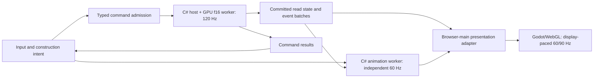

# Simulation–presentation bridge

**Current architecture:** [Canonical Half game values and WGSL f16 physics](gpu-f16-physics.md) define the numerical model. Current design/acceptance is self-contained; implementation and qualification status are in [TODO](../TODO.md).

Status: **required target design; implementation and qualification open**. Updated 2026-10-01 to the mandatory [independent worker target](planning/requirements.md#worker-loop-target), tracked by PERF-06 and PERF-31–48. Use alongside the [general engine contract](general-physics-capability-audit.md), [performance plan](browser-physics-performance.md) and [visual design contract](../DESIGN.md).

**Execution priority:** Complete the physics engine, rendering engine, dedicated simulation worker and separate animation worker, with their required generic capabilities and qualification, through **P0-035** in the [authoritative execution register](delivery-workflow.md#pipeline-priority) before product, component or campaign work. Prove required capabilities using the current catalogue and typed, UI-placeable generic qualification fixtures; future catalogue elements are not prerequisites for the engine gate. Preserve their later implementation and integration scope.

**Standing requirements:** The [permanent architecture, performance and forward-only requirements](delivery-workflow.md#standing-requirements) apply before and after P0-035 to every implementation, content and tooling change. Physics, animation and rendering keep independent clocks and execution contexts. Sustain the binding 60 FPS budgets on declared supported workloads and qualify 90 FPS on capable displays/devices; unavailable or failing evidence stays incomplete. No later optimization may recombine the loops, move authoritative work onto the renderer, introduce compatibility paths or weaken correctness to satisfy a timing target.

## Decision and boundaries

Typed commands change canonical Half game state through a dedicated simulation Web Worker whose C# host owns discrete transactions and WebGPU/WGSL f16 kernels own continuous physical state; committed snapshots and events cross bounded message transport to a separate C# animation worker and the browser-thread presentation adapter. This command/read boundary does not require event sourcing, databases or a broker. The current in-process implementation is an intermediate migration state, not the required execution architecture.

The simulation owns physical laws, bodies, stores, network state, sensors, controllers, pending events and lifecycle. It knows no mesh, material resource, camera, Godot node or animation implementation. A host/application coordinator handles user intent and lifecycle orchestration; a generic adapter binds typed simulation identities and observable capabilities to presentation assets. Per-element physical equations or solvers are forbidden in every context, including the bridge; typed declarations feed shared WGSL f16 laws under the [general-engine contract](engine-contracts.md#general-data-driven-engines).

The [gameplay lifecycle criteria](planning/requirements.md#sequence-task-145) require complete transaction coverage; a reentrancy guard alone is insufficient. Validate the current caller inventory and rollback of every enrolled operation before claiming atomic publication.

The same bridge serves mechanics, heat, fluid/gas inventory, electrical state, optical paths, acoustic pulses, field effects and exposure. Read contracts expose meaningful physical observables with units and typed identities. The adapter maps them to colour, mesh deformation, symbols or audio. Arbitrary property bags, string-keyed topics, concrete-part dispatch and hidden executable payloads are not a generic contract.

## GPU and canonical-value boundary

The [current numeric/resource contract](gpu-f16-physics.md) governs packed half values, integer cell/scale metadata, pre-operation range guards, GPU completion before commit, device loss and raw committed checkpoints. Editor controls, current content, construction saves, animation/read models and fixtures use typed Half values; render/browser APIs widen only at validated adapters. Save is construction-only and Reset restores canonical admitted bits exactly. Do not assume Godot Export/Variant supports Half directly: use a declared raw-bit resource codec or validated adapter, reject obsolete schemas, and test every affected consumer. GPU admission/query results are authoritative; CPU previews cannot approve a different geometry. Same-environment replay binds adapter/driver/shader/compiler and canonical reduction order; cross-device physical comparison uses approved error bounds, while IDs/events remain exact.

## Command contract

Represent operations with enum-typed discriminants and compiler-checked payload types. Use strongly typed command, entity, body, connection, world-generation and revision IDs, and integer ticks/sequences. A command envelope includes protocol version, target generation, ordering information and any required expected revision; record the applied simulation tick, phase and deterministic order in its result/replay record. Preserve signed and unsigned 64-bit identities losslessly across C# and JS boundaries. Golden round-trip/rejection vectors must cover values around 2^53, integer maxima, zero/default values, overflow, malformed lengths and unknown enum values. Simulation events and rejected-command reasons remain enums through callers, collections and tests; serialize only at validated external boundaries.

Commands express intent: create/move an authored assembly in construction mode, connect compatible ports, set a supported controller input, Run, pause, step, Reset or Load. They are not arbitrary setters for physical velocity, temperature or energy. A generic law may accept a validated physical boundary input, but the presentation layer cannot invent it to obtain a desired outcome.

Separate admission from application. Admission checks shape/schema and queue capacity; the simulation owner validates current topology, permissions/mode, capability and revision immediately before application. Acceptance into the queue is not evidence that the operation committed. Publish a typed result identifying the command and committed revision or explicit rejection reason.

Assign deterministic order within an explicit application boundary: construction edits can commit while paused at an idle boundary; runtime control changes apply at defined simulation ticks/phases. Specify target-tick and late-arrival policy where scheduling is exposed. Exact replay compares the same commands at the same applied ticks, phases and order; identical command order with different arrival/application times is not an equivalent input history. Preserve dependent action order and never Run ahead of accepted placement/link changes.

Reject stale-generation and incompatible stale-revision commands explicitly. Repeated command IDs must not repeat their effects: retain a bounded result/sequence contract, with explicit rejection outside the supported acknowledgement window. A cancellation request can cancel only pending work; it cannot silently undo an already committed physical action.

Coalesce only explicitly replaceable pending intent, such as successive updates to the same drag preview within one edit session. Do not merge pulses, releases, connect/disconnect, Run/Reset/Load or commands separated by a dependent action. Responsive ghost previews are presentation-only until their construction command is acknowledged.

## Committed read model and query services

Publish a compact snapshot after the entire gameplay transaction succeeds. Include generation, committed tick/revision and simulation time, stable topology/resource binding revisions, poses and requested domain telemetry. Include sufficient previous/current state for interpolation and reconstruction after a skipped render frame. Never expose live PhysicsBody objects, mutable dictionaries or pooled spans with an unspecified lifetime.

Snapshots are immutable to readers. Transfer buffers have one owner and bounded acquire/release/recycle lifetimes; generation and sequence validation precedes application. The existing in-process previous/current leases do not establish cross-worker ownership. Retained captures require owned storage. Qualify transport slots, acknowledgements, copied bytes and backpressure before cutover; do not copy the complete solver world each frame.

Publish one coherent revision across domains. Physical events, topology, poses and quantities must not come from different commits. Apply create/remove/rebind information before state that refers to those identities; reject stale handles with generation checks. Reset and rollback discontinuities reseed both displayed states rather than interpolating across them.

Dirty lists can reduce node writes and uploads. If transport uses deltas, each delta must name its base revision and the consumer must validate it. Skipping an intermediate delta cannot lose an unchanged field; rebuild from a complete snapshot when needed. Pack bounded typed batches into explicitly owned transferable buffers; include actual .NET-to-JS copies in the budget and never expose a live managed heap view across runtimes. No per-frame JSON, reflection or message allocation per body.

Read-only authoritative queries are a separate typed service for placement validation, physical picking/inspection and save barriers. Batch queries and stamp results with the generation/revision they describe. Preview reads may lag; any subsequent mutation revalidates against authoritative state. Interpolated graphics may support cosmetic picking, but cannot decide collision validity, sensor activation or persisted physical state.

## Event delivery and backpressure

Separate replaceable state from nonreplaceable occurrences. Rendering may skip intermediate pose snapshots when it has a coherent recent interpolation pair. It must not lose a short pulse, impact, trigger result, command acknowledgement or entity deletion just because no frame was drawn.

Commit events with the corresponding state and stamp them with typed identity, sequence, tick/time and generation. Presentation consumes each committed occurrence at most once according to explicit cursors; replayed delivery does not repeat audio/release feedback. Internal physical consumers execute within the simulation schedule; they do not depend on the graphics event queue being drained.

Define bounded capacities and observable high-water marks for command, result and event channels. Reserve publication capacity before a transaction or retain its publication record safely; never commit physical state and then silently discard required output. On saturation, stop admitting affected work or pause at a committed boundary with explicit status while the host continues servicing input/presentation. Document how Reset/Load can still be requested; control handling must not deadlock behind an undrainable queue.

This is a bounded in-memory lifecycle contract, not durable event sourcing. Ordinary save data remains an authoritative snapshot. If replay history is offered later, it has its own retention and deterministic-state contract.

## Transaction, Reset and save semantics

For a gameplay tick: obtain the admitted boundary inputs, evaluate domains and resolve coupled transfers, commit all owned state, then publish its snapshot, events and command results. Failed work restores the complete pre-transaction state and publishes no partial poses or success notifications. Error reporting is separate from committed physical events. Releasing an Idle/Stepping guard does not satisfy rollback.

Run validates and captures the authored construction. Reset/Load are lifecycle barriers applied at an idle committed boundary; successful replacement advances generation, invalidates old pending commands/query results/events and establishes a complete new snapshot. Return explicit outcomes for commands invalidated by the barrier. A failed Load must preserve the prior usable generation and state.

Pause/step/resume have explicit simulated-time semantics independent of rendering. Save captures the chosen supported authoritative state at a committed barrier, including pending domain events where required by the save contract. Never save interpolated poses. Define whether each save operation captures construction or supported runtime state; reject unsupported capture requests.

Do not replay old transient effects after Reset or attach old results to a newly reused body index. Test lifecycle changes while commands/events are pending, during a render frame with no physics tick, and after multiple ticks without a render frame.

## Independent animation system

Implementation priority: follow the [authoritative execution register](delivery-workflow.md#pipeline-priority) through P0-035 before product, component or campaign work. Deliver and qualify the complete required generic engine capabilities, both workers and renderer; declarations or a single working mechanism do not close that gate. Register typed reusable definitions and target bindings centrally, reject property-writer conflicts and maintain reusable active-instance storage. Evaluate cosmetics on the animation worker's independent clock, initially 60 Hz; only final scene-property application is paced by rendered frames. Measure worker evaluation and browser-thread application separately within total budgets, including animation-only workloads with physics stopped. Required generic domains qualify through current parts or UI-placeable fixtures before P0-035; later product integration and final-catalogue audits remain required.

Animation is a separate presentation service, not a physics subsystem. It owns visual phase, clips, procedural loops, easing, transitions, effect lifetimes and animation clocks. Physics owns only physically meaningful motion and state. A motor's decorative spinning mesh declares a repeating track evaluated by the shared C# animation engine, never a motor-specific loop or evaluator; it needs no simulated rotor/inertia, angular-travel history or per-tick pose publication solely for that visual.

Procedural definitions are typed parameters for reusable evaluators, not embedded code, per-element delegates or catalogue-keyed worker branches. Missing behavior extends a shared evaluator within its consuming slice; element-specific art and curve values remain data.

Use typed drive modes for autonomous cosmetics, UI-driven effects, optional physical event/state feedback and authoritative-pose presentation. Animation does not require physics input: UI attention, selection and ambient loops can run with no world or while physics is paused. State-informed effects may consume active/direction or meaningful signed speed without owning the physical state. An event-triggered recoil remains animation, not a spring simulation merely because an impact triggered it.

A genuine lever contact surface, pusher head or moving shield must still display its committed physical pose. Compose decorative offsets on presentation-only child nodes where safe; never animate a functional surface through an obstacle or change optical/field geometry through artwork. Preserve actual motor torque, shaft inertia and work where mechanically relevant, independent of whether any spinning mesh exists.

Assign one writer per visual property. The adapter binds physical poses and optional semantic signals; the animation service controls cosmetic channels; composition resolves their transforms deterministically before drawing. Do not store cosmetic phase in physics snapshots, force it into the physics event scheduler, or feed an animated transform back into authoritative queries.

Declare animation clock/lifecycle policies explicitly: monotonic elapsed time for autonomous effects, optional simulated-time synchronization for feedback that needs it, and clear pause/slow-step/success/hidden-tab behavior. Map clock origins and generations explicitly; worker timer callbacks wake evaluation but do not define elapsed time. Publish timestamped samples and evaluate independently of render callbacks. Reset/Load cancels stale effects and restores visual baseline by generation; physical save/replay needs no cosmetic phase. If presentation persistence is wanted, declare it separately. Respect reduced-motion preferences without altering physical behaviour.

Batch active updates and reuse state. Offscreen or inactive loops can stop updating when no visible dependency exists; resume at the policy's current phase without replaying missed frames. Active cosmetics still request rendering even when physics is idle. Qualification compares identical authoritative results with animations disabled, enabled and running at different frame rates, plus real-UI motion, exact Reset and measured presentation cost.

## Rendering and asynchronous execution

The presentation adapter interpolates poses from committed simulation timestamps, widens committed canonical half values exactly to the required render floats at the boundary, updates changed nodes/resources, and emits the final coherent scene changes before Godot draws. It owns physical-pose binding, mesh/material bindings, visual LOD, dirty tracking and camera state; the independent animation service owns cosmetic clocks and motion. Keep authoritative contact and interaction geometry independent of camera-dependent visual geometry.

Use event timestamps for short effects and latest state for continuous indicators. Suspended offscreen cosmetic work resumes at the appropriate current visual state without replaying all missed effects. Define that policy per effect class while retaining required feedback/events. Paused simulation is not proof that all UI, camera and post-success animation is idle.

Leave drawing-buffer presentation to Godot/WebGL. An extra application image buffer is not required. Dirty object/resource updates and qualified idle-frame suppression are the first optimizations; full 3D dirty-region painting remains conditional on measured benefit and correct depth/transparency/shadow invalidation.

The inspected 2dog browser host is a single-threaded starting point, not evidence that worker execution is already implemented. `async` methods alone do not create CPU parallelism; see [.NET async guidance](https://learn.microsoft.com/en-us/dotnet/csharp/asynchronous-programming/async-scenarios). The required runtime uses a dedicated simulation worker owning C# discrete control and WebGPU numerical resources, a separate C# animation worker and the browser main thread for rendering/input. Preserve 120 Hz simulation with four outer substeps until a separately qualified numerical change, initial independent 60 Hz animation evaluation and display-paced rendering. Each worker yields bounded batches to its control mailbox without exposing partial physics state.

Worker transport is mandatory under PERF-39–48: separate .NET WASM runtimes own simulation and animation, while Godot remains on the browser thread. Use owned transferable messages without requiring shared-memory threading or OffscreenCanvas. Forward-replace the synchronous execution path; no optional backend or single-thread fallback. Qualify ordering, transfer/copy costs, bounded queues, clock mapping, asynchronous lifecycle acknowledgements and worker failure. Missing capabilities or failed worker startup produce explicit unsupported/error states with usable pending/recovery UI, never browser-thread substitution. Rendering consumes completed timestamped histories at one coherent display time without waiting synchronously for a producer; Godot's physics interpolation fraction is not the worker clock. The [worker budgets and adversarial gates](planning/requirements.md#worker-performance-budgets) are authoritative.

## Performance and acceptance

Include bridge costs inside the binding CPU/frame budgets. Required transport/bridge CPU service p95 is ≤1 ms per presented frame at each declared workload, including command drain, amortized publication, packing/unpacking, copies and final application. Aggregate raw attributable service across contexts before calculating percentiles; do not sum stage percentiles or overlapping elapsed spans. Require zero routine warmed scratch allocation and explicitly budget unavoidable copies. These are mandatory acceptance limits, not achieved measurements. Record bytes, queue depth/age, physical and animation sample age, event backlog, dirty writes and input-to-visible latency at 60/90 Hz. Preserve 120 Hz simulation, new topology and heavy domain telemetry; missing required state or feedback cannot buy a pass. Incremental work meets its predeclared scoped regression gate while retaining unresolved release failures; P0-035 and subsequent supported releases must satisfy the full applicable budgets.

For every full normal active capture, require sustained distinct-frame rate ≥59.4 FPS for the 60 FPS tier and ≥89.1 FPS for the 90 FPS tier: an explicit 1% pacing tolerance around nominal cadence. Missed scheduled cadence slots must be ≤1%. P0-003 must predeclare the slot schedule, distinct-presentation measurement, observability and capture boundaries for the target display. Retain every normal active stall in the denominator and raw evidence; duplicate frames, repeated callbacks, selected windows or discarded stalls cannot inflate the result. Missing presentation/slot observability leaves the tier incomplete. These rate/slot gates supplement every existing p95/p99, CPU/GPU, freshness and throughput limit.

Apply common/profile proof according to the [task stage gates](delivery-workflow.md#stage-gates). Element I and CLEAN rows close their scoped implementation, build, boundary, cleanup and applicable existing-behavior regression checks; they do not require the later U row's new-element UI proof or the retained closure row's publication. U owns its complete named positive/control/integration/Reset/save/motion proof; the retained closure owns final evidence reconciliation and publication. An intermediate stage pass never closes the element or waives any later gate, and P0-035 still requires all scheduled engine qualification.

Qualification must cover:

- Commands accepted/rejected/duplicated/stale, paused construction, dependent order, applied tick/phase replay and lossless integer boundary mappings.
- Queue saturation, reader lag, missed snapshots/delta gaps and repeated delivery.
- Independent animation at 30/60/90/120 Hz and rendering at 30/60/90/120/144 Hz, multiple/no simulation ticks between frames, consumer delays and hidden-tab resume. Synthetic cadence does not qualify actual display FPS.
- Failed substep/domain commit with exact full rollback and no leaked success/event/state.
- Reset/Load/save/pause barriers with pending commands, events and retained readers.
- Part creation/removal/handle reuse, moving geometry and interaction-domain telemetry.
- Architecture tests proving physics/law modules have no rendering or concrete-part dependencies.
- Per-part real-UI construction, positive/negative/integration, typed-link checks, exact Reset/save and continuous motion evidence.
- Production browser builds and matched end-to-end timing on physical devices, with failures and revision/artifact hashes retained.

Refactor current implementations, callers, authored content, tooling and tests forward together; remove superseded presentation callbacks, mutation paths and schedulers when their consumers move to the new contract. No compatibility shims, old-name aliases, legacy modes, automatic format/schema migration, fallback implementations or duplicate authoritative state may remain. Reject unsupported current inputs explicitly rather than inferring obsolete fields or substituting behavior. Preserve historical evidence unchanged without supporting it as current input. The bridge is complete only when these proofs and the P0-035 engine gate pass; later product integration retains its own current proof obligations.
